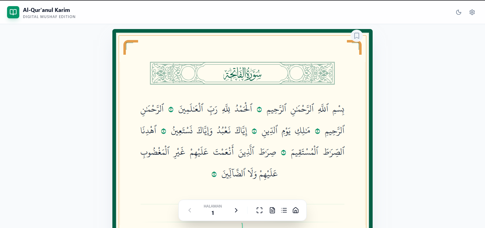

<div align="center">


# Mushaf Al-Qur'an Karim Digital

Aplikasi Mushaf Al-Qur'an Digital interaktif yang dibangun dengan React, Vite, dan Tailwind CSS. Aplikasi ini dirancang untuk memberikan pengalaman membaca Al-Qur'an yang nyaman secara digital dengan fitur pencarian surah, pengaturan tampilan, dan mode cetak.

</div>

---

## ✨ Fitur Utama

- **Daftar Surah Lengkap**: Akses cepat ke seluruh surah dalam Al-Qur'an.
- **Navigasi Cepat**: Fitur "Jump to Surah" untuk berpindah antar surah dengan mudah.
- **Pengaturan Tampilan**: Kustomisasi ukuran font dan tata letak sesuai kenyamanan.
- **Mode Cetak**: Dukungan pencetakan halaman mushaf dengan gaya yang dioptimalkan.
- **Progressive Web App (PWA)**: Dapat diinstal di perangkat Anda untuk akses offline (mendatang).
- **Responsif**: Tampilan yang optimal di berbagai perangkat (Mobile, Tablet, Desktop).

## 🚀 Teknologi yang Digunakan

- [React 19](https://react.dev/)
- [Vite](https://vitejs.dev/)
- [TypeScript](https://www.typescriptlang.org/)
- [Framer Motion](https://www.framer.com/motion/) (Animasi)
- [Lucide React](https://lucide.dev/) (Ikon)
- [Tailwind CSS](https://tailwindcss.com/)

## 📚 Sumber Data

Data Al-Qur'an dalam aplikasi ini diambil dari:
- **[Al Quran Cloud API](https://alquran.cloud/api)**: Menyediakan teks ayat, informasi surah, dan metadata Mushaf.

## � Cara Menjalankan Secara Lokal

**Prasyarat:** Node.js (versi terbaru direkomendasikan)

1. **Clone Repository:**
   ```bash
   git clone https://github.com/abidbackupsept/mushafdigital.git
   cd mushafdigital
   ```

2. **Instal Dependensi:**
   ```bash
   npm install
   ```

3. **Jalankan Project:**
   ```bash
   npm run dev
   ```
   Buka `http://localhost:5173` di browser Anda.

## 🛠️ Build untuk Produksi

Untuk membuat build produksi yang dioptimalkan:
```bash
npm run build
```
Hasil build akan tersedia di folder `dist/`.

## 📄 Lisensi

Proyek ini dibuat untuk tujuan pembelajaran dan kebermanfaatan umat. Silakan gunakan dan kembangkan lebih lanjut.

---
<div align="center">
Dibuat dengan ❤️ untuk umat.
</div>
